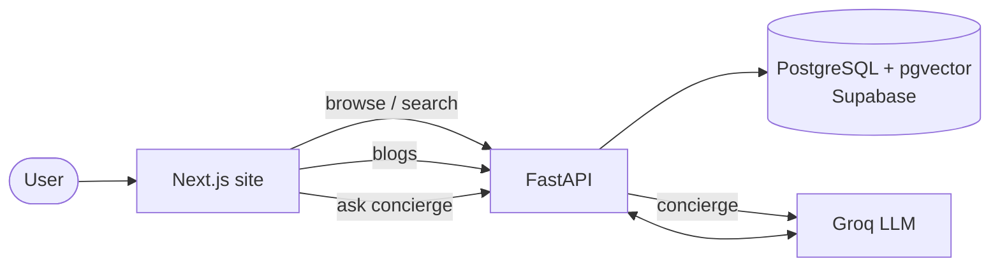

#  MMDb — Maven Munch Db

### A food discovery website with an AI-based culinary concierge.

Search places and dishes, read food blogs, and ask the concierge for recommendations — all grounded in a curated database.

**[🔗 Live Demo →](https://mmdb-site.vercel.app)**

---

## Overview

MMDb (Maven Munch Database) is a food discovery platform that brings three things together in one site:

- **Search & discovery** — browse and filter restaurants, cafés, and dishes.
- **Editorial** — food blogs and guides.
- **AI culinary concierge** — ask in natural language and get recommendations drawn only from the database.

---

## The culinary concierge

An AI-based concierge that answers natural-language queries such as *"veg-friendly cafés near me"* or *"best biryani nearby"*. It plans its own search across the database — combining keyword and semantic (vector) retrieval, ranked by relevance, quality, and location — and is verified against the database so it never recommends a place or dish that doesn't exist.

- **Hybrid search** — lexical and semantic (pgvector) retrieval over a composite relevance score.
- **Location-aware** — resolves named areas and device GPS to real coordinates and ranks by distance.
- **Conversational memory** — remembers constraints across turns within a session.
- **Grounded** — outputs are continuously checked against the database by an automated eval harness.

---

## Architecture

---

## Tech stack

| Layer | Technology |
|-------|------------|
| **Frontend** | Next.js, TypeScript, Tailwind |
| **Backend** | FastAPI, SQLAlchemy (async), Python 3.11 |
| **Database** | PostgreSQL + `pgvector` (Supabase) |
| **AI** | Groq (LLM) · OpenAI embeddings |
| **Deploy** | Vercel (frontend) · Render (backend) |

---

Built by **Mubeen S** · [LinkedIn](https://www.linkedin.com/in/mubeen-smo) · [GitHub](https://github.com/mubeen-smo)

