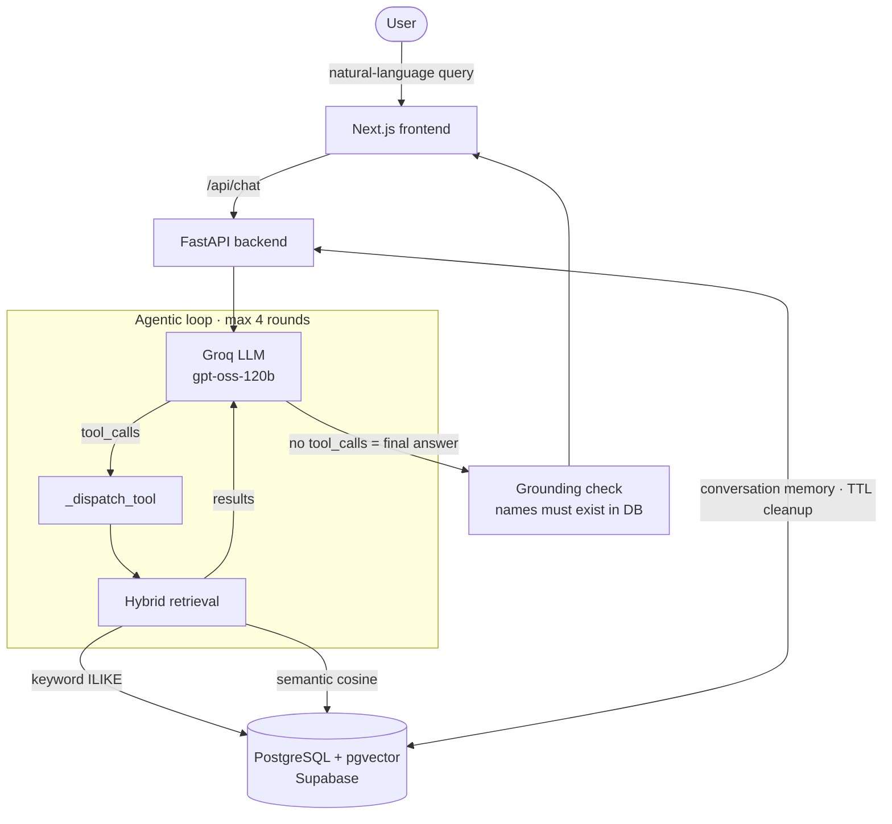

<div align="center">

# 🍽️ MMDb — Maven Munch Db

### An agentic RAG food concierge for Hyderabad.

Ask in plain English — *"best biryani in the old city"*, *"suggest best desserts"*, *"good food near me"* — and get grounded, opinionated recommendations drawn **only** from a curated database, never hallucinated.

**[🔗 Live Demo →](https://REPLACE-WITH-YOUR-LIVE-URL.vercel.app)**


</div>

---

## What it is

MMDb (Maven Munch) is an AI food-discovery assistant for Hyderabad. Unlike a generic chatbot, it is **retrieval-grounded**: every place and dish it names is verified to exist in its database, so it gives the confident, local-critic feel of a knowledgeable friend without inventing restaurants.

It is a genuinely **agentic** system — the language model decides which tools to call, in what order, across a multi-round loop — wrapped in deterministic guardrails that keep it correct, location-aware, and cheap to run.

---

## Why it's interesting (the engineering)

This isn't a single-shot "stuff documents into a prompt" RAG demo. The parts worth a look:

- **Agentic tool-calling loop** — the LLM plans its own retrieval: it chooses `search_places` / `search_items`, reads the results, and decides whether to search again or answer. Bounded by a circuit breaker so it always terminates.
- **Hybrid retrieval** — every query runs *two* passes in parallel: lexical (`ILIKE` keyword match) and semantic (pgvector cosine similarity over OpenAI embeddings), merged by a composite score. Catches both exact terms and meaning.
- **Deterministic location-awareness** — "near Madhapur" is resolved to real coordinates (area centroid) and ranked by haversine distance; "near me" uses device GPS. Location correctness is enforced in code, not left to the model's discretion.
- **Anti-hallucination, verified** — a custom evaluation harness drives the real UI and checks that *every* recommended name exists in the database, judged by a different model family to avoid self-grading bias.
- **Token-efficient** — tool payloads sent to the model are slimmed to only what's needed to write an answer, keeping the agentic loop affordable on commodity inference.

---

## Architecture



**Request flow:** a query enters via the Next.js UI, hits the FastAPI `/chat` endpoint, and runs through the agentic loop. The model emits tool-call requests; the backend executes them against Postgres (hybrid keyword + vector search), feeds results back, and loops until the model produces a final, grounded answer.

---

## How it works

### 1. The agentic loop

The backend assembles the message list — **system prompt → recent conversation history → latest user turn** — and calls the model with the available tools. Each round, the model returns *either* a tool call *or* a final answer:

- **`tool_calls` present** → the backend parses the arguments, dispatches to the real Python function (injecting server-only parameters like the DB session and user coordinates that the model never sees), runs it, and appends the result for the next round.
- **`tool_calls` empty** → the model has its answer; the loop exits and returns it.

A `MAX_ROUNDS` ceiling acts as a circuit breaker; on the final round `tool_choice` is forced to `"none"`, guaranteeing the model produces an answer instead of looping forever.

### 2. Hybrid retrieval & scoring

Each tool call fans out into a keyword pass and a semantic pass:

| Pass | Mechanism | Catches |
|------|-----------|---------|
| **Keyword** | `ILIKE` substring match | exact dish/place names, tags |
| **Semantic** | `text-embedding-3-small` → pgvector cosine (`<=>`) | meaning, synonyms, vibe |

Results merge on a composite score:

```
final_score = semantic_similarity            # 1 − cosine distance
            + (rating / 10) * 0.3            # quality, lightly weighted
            + proximity * 0.2               # location, when relevant
```

### 3. Location-awareness

- **"near Madhapur"** → the named area is resolved to a coordinate (centroid of places in that area), then haversine distance from that point feeds the proximity term.
- **"near me"** → device GPS coordinates, injected server-side, are used as the reference point.
- **no location intent** → proximity is simply not applied.

### 4. Grounding & memory

Conversation state is persisted server-side per `conversation_id` (with TTL cleanup), so the assistant remembers constraints across turns ("I'm vegetarian" → stays vegetarian). Crucially, the assistant is constrained to recommend **only** what retrieval returns — verified by the evaluation harness below.

---

## Quality: the evaluation harness

Most LLM demos have no quality gate. MMDb ships with one. The harness (`eval/`) drives the **real** `/ask` web UI with Playwright and grades each case on three layers:

1. **Hard asserts** — HTTP 200, non-empty reply, latency bound, no UI error.
2. **Grounding** — every **bolded** place/dish in the reply is checked against the live database. This is the core anti-hallucination guarantee.
3. **LLM judge** — a model from a *different family* than the one under test scores the transcript against a per-case rubric, avoiding self-grading bias.

Cases cover grounding, tool-use, multi-turn memory, geo-proximity, empty-result honesty (it must say "nothing matched" rather than invent), and robustness (gibberish + prompt-injection resistance).

---

## Tech stack

| Layer | Technology |
|-------|------------|
| **Frontend** | Next.js, TypeScript, Tailwind |
| **Backend** | FastAPI, SQLAlchemy (async), Python 3.11 |
| **Database** | PostgreSQL + `pgvector` (Supabase) |
| **LLM** | Groq (`gpt-oss-120b`) via OpenAI-compatible API |
| **Embeddings** | OpenAI `text-embedding-3-small` (1536-dim) |
| **Eval** | Playwright, cross-family LLM judge |
| **Deploy** | Vercel (frontend) · Render (backend) |

---

## Running locally

> Requires Python 3.11+, Node 18+, and a PostgreSQL database with the `pgvector` extension.

```bash
# Backend
cd backend
pip install -r requirements.txt
cp .env.example .env        # set DATABASE_URL, GROQ_API_KEY, OPENAI_API_KEY
uvicorn app.main:app --reload

# Frontend
cd frontend
npm install
npm run dev                 # http://localhost:3000

# Evals (optional)
cd eval
pip install -r requirements.txt
playwright install chromium
python run.py --base-url http://localhost:3000
```

---

## Project structure

```
mmdb/
├── backend/
│   └── app/
│       ├── agent/          # agentic loop, tool definitions, retrieval
│       ├── place/          # place model, schemas, routes
│       ├── item/           # dish model, schemas, routes
│       └── core/           # database, config
├── frontend/
│   └── src/                # Next.js app, UI components
└── eval/                   # Playwright quality harness + rubrics
```

---

## Roadmap

- Occasion-aware ranking (date / family / celebration) via existing `good_for` tags
- Server-side place→item coupling so dish queries inherit location scope deterministically
- Production grounding guardrail (promote the eval's anti-hallucination check into the live response path)

---

<div align="center">

Built by **Mubeen S** · [LinkedIn](https://www.linkedin.com/in/mubeen-smo) · [GitHub](https://github.com/mubeen-smo)

</div>
